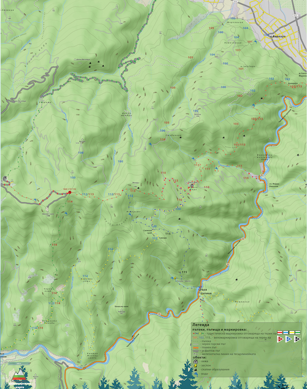
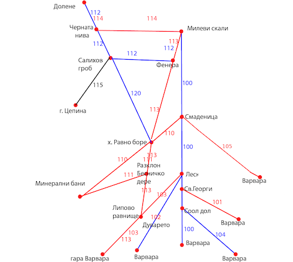

## Сегментиране и маршрути от байк център “Варвара”

Повечето маршрути от байк център “Варвара” започват по **отсечка с идентификатор 100**. Отсечката представлява изкачване по плавен черен път, който свързва с. “Варвара” с вр. Милеви скали. Така определената отсечка дава връзка към почти всички други отсечки в района.

Отсечки **101, 102, 103, 104 и 105** представляват пътеки, отбиващи се от пътя отсечка **100** до с. Варвара. Всяка от тях, в комбинация с отсечка **100**, формира съответно маршрутите **Варвара - м. Свети Георги - Варвара (100 + 101), Варвара - Леската - Варвара (100 + 102), Варвара - Липово равнище - Варвара (100 + 103), Варвара - Сухия дол - Варвара (100 + 104), Варвара - м. Смаденица - Варвара (100 + 105).

Отсечки **112, 113 и 114** са интересни с това, че в известна част от протежението си съвпадат. Този избор е направен нарочно, защото в противен случай, ако всеки един от съвпадащите участъци беше отделна отсечка, общият брой отсечки и номера щеше да стане излишно голям. В крайна сметка, вариантът със съвпадащите отсечки се оказва по-прост за маркиране и следване. 

Пример за описване на маршрути може да видите тук: [информационно табло до връх Милеви скали](https://drive.google.com/open?id=1mXP6d9BmWMejzedSakMfoKWEioVAA-FF) 